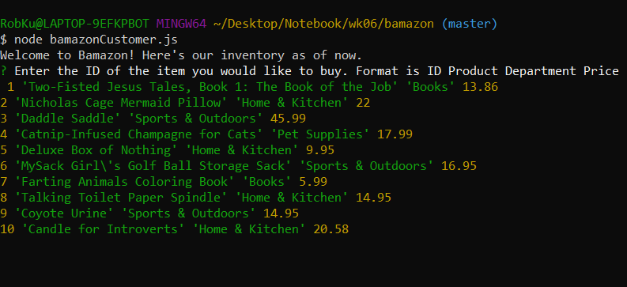
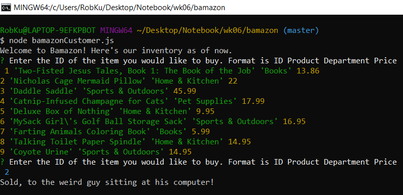
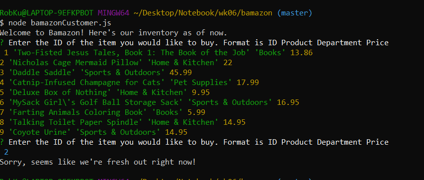

# Bamazon

Bamazon is an app that will forever change the face of online shopping. The birds shall never again take to the skies, humbled by the majesty of what I have created.
It's also an incredibly (seriously, incredibly) simplified back-end for inventory management, but I prefer to pay attention to the whole majesty thing.

#Dependencies
Inquirer
MySql

#Usage

Bamazon can be accessed through node with the command "node bamazonCustomer.js".
On load, Bamazon will display the current inventory

As you can see, Bamazon's inventory is drawn only from the finest sources. 

To make a purchase, simply enter the ID number of the item you wish to own. The number can be found to the left of the item's name.
Let's buy a Nicholas Cage Mermaid Pillow. It make a great gift for that person who you love, but you also want to feel slightly unnerved whenever they see their throw pillows!

If the item is out of stock, an error message will display.
You know what? let's get another one of those pillows. I'm sure there are two people you love but don't really like!

Ooh, looks like there was only the one. Well, maybe a good old-fashioned bottle of Coyote Urine will sooth the ache left from the knowledge that they will have to live without that pillow!
